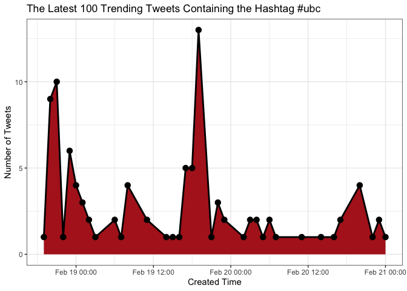
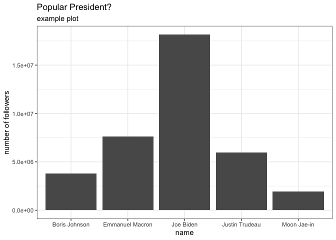
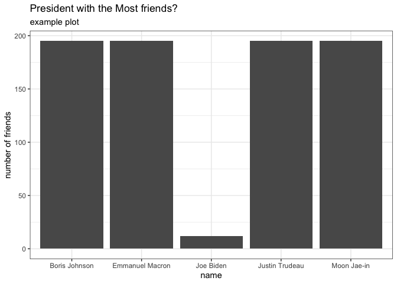

twitterapiR
================

## Description

<!-- badges: start -->

[](https://github.com/tangaot/twitterapiR/actions)
<!-- badges: end -->

This project is an API wrapper for Twitter in R. This package provides
user friendly functions for the users to query information from Twitter.

Current list of functions included in the wrapper:

-   set_bearer(“API key”, “API secret”)
-   get_bearer()
-   user_friends(screen_name, number)
-   searchTweets(searchString, resultType, count)
-   followersCount(screen_name)

## Installation

``` r
if (!require("remotes")) {
  install.packages("remotes")
}
remotes::install_github("tangaot/twitterapiR")
```

## Authentication

You will need to follow these instructions to continue. We are accessing
***Twitter*** programatically. ***twitterapiR*** uses the **httr**
package under the hood to manage this.  
The first step is to create a ***Twitter*** application for yourself. To
do so, go to the [Developer Platform’s
page](https://developer.twitter.com/en/docs/twitter-api/getting-started/getting-access-to-the-twitter-api)
and log in.

Follow the instruction and fill in some basic info. After your project
is created, you can generate your consumer API and Secret key.

In your R session, you will want to do the following using the
appropriate values from the web page:

                                set_bearer("API key", "API secret")
                                

This will authenticate via **httr**, we recommend looking at the Token
man page of this package for more information regarding how to manage
the authentication and caching processes.

## Getting Started

This document is intended to describe the usage of each function and to
show examples of each function. To explore the source code or report
some issues, we recommend going to our
[GitHub](https://https://github.com/tangaot/twitterapiR). Before
exploring our functionality, please make sure you complete the following
steps.

## Function Usage

The `set_bearer` function sets key and secret key as environment
variables.

-   **key**: Twitter API key are used to authenticate requests.
-   **secret**: Twitter API key secret are used to authenticate
    requests.

``` r
set_bearer('YOUR-KEY-HERE', 'YOUR-SECRET-HERE')
```

The `get_bearer` function is a helper function that can be used to
generate the bearer key by using `API key` and `API secret`. It is
embedded in the functions `searchTweets`, `user_friends`, and
`followersCount`. The bearer key allows the users to query information
from Twitter.

``` r
get_bearer()
```

The `searchTweets` function can be used to search for related tweets
that match the specified string.

Parameters:

-   **searchString**: a string of 100 characters maximum we want to
    search for in the tweet, it can contain hashtag in order to search
    some tag in Twitter.

-   **count**: count will restricts the maximum number of tweets return.
    Default is 5.

-   **resultType**: it will specifies what type of search results you
    would prefer to receive. The default is “mixed.” Valid values
    include:

                      - mixed: Include both popular and real time results in the response

                      - recent: return only the most recent results in the response

                      - popular: return only the most popular results in the response

The function will return a dataframe contains following columns:

-   created_time: When this tweet was created
-   user_name: The name of who post this tweets
-   user_screen_name: The screen name of who post this tweets
-   user_followers_count: The number of followers of who post this
    tweets
-   text: The text of this tweet
-   truncated: Whether this tweet was truncated
-   favorited: Whether this tweet has been favorite}
-   retweeted: Whether this tweet has been retweeted
-   favorite_count: The number of times this tweet has been favorited
-   retweet_count: The number of times this tweet has been retweeted

In the example below `searchTweets()` function returns all the users who
recently used #ubc.

``` r
# Use `searchTweets` functions to search for the top 100 recent tweets using #ubc
ubc_tweets <- searchTweets("#ubc", resultType = "recent",count = 100)

head(ubc_tweets)
#>                     created_time     user_name user_screen_name
#> 1 Mon Feb 21 00:03:22 +0000 2022   Park Ranger        netminnow
#> 2 Sun Feb 20 23:45:04 +0000 2022         Sandy         sandysva
#> 3 Sun Feb 20 23:01:07 +0000 2022     16forward        16forward
#> 4 Sun Feb 20 22:17:50 +0000 2022 Richard Ajabu     richardajabu
#> 5 Sun Feb 20 20:52:01 +0000 2022   Toronto_Bot      Toronto_Bot
#> 6 Sun Feb 20 20:48:22 +0000 2022 Richard Ajabu     richardajabu
#>   user_followers_count
#> 1                 5349
#> 2                  833
#> 3                   43
#> 4                    0
#> 5                  401
#> 6                    0
#>                                                                                                                                            text
#> 1 RT @richardajabu: @mccaffreyr3 @selectedwisdom As Putin continues the slow motion conversion of EUkraine to RUkraine,\nwhy isn't the west re…
#> 2 RT @richardajabu: @mccaffreyr3 @selectedwisdom As Putin continues the slow motion conversion of EUkraine to RUkraine,\nwhy isn't the west re…
#> 3 RT @richardajabu: @mccaffreyr3 @selectedwisdom As Putin continues the slow motion conversion of EUkraine to RUkraine,\nwhy isn't the west re…
#> 4   Complete Fail. Sad for UK. 🙄\n\nhttps://t.co/sRps0Vf2HP\n#cdnpoli #uspolitics #ukpolitics #eu #auspol #nzpol #yow… https://t.co/V4HroUXrAq
#> 5 RT @richardajabu: @mccaffreyr3 @selectedwisdom As Putin continues the slow motion conversion of EUkraine to RUkraine,\nwhy isn't the west re…
#> 6 @mccaffreyr3 @selectedwisdom As Putin continues the slow motion conversion of EUkraine to RUkraine,\nwhy isn't the w… https://t.co/IofYO2JrWD
#>   truncated favorited retweeted favorite_count retweet_count
#> 1     FALSE     FALSE     FALSE              0             4
#> 2     FALSE     FALSE     FALSE              0             4
#> 3     FALSE     FALSE     FALSE              0             4
#> 4      TRUE     FALSE     FALSE              0             0
#> 5     FALSE     FALSE     FALSE              0             4
#> 6      TRUE     FALSE     FALSE              8             4
```

``` r
# Select those with start=5 and end time=13
created_time <- substr(ubc_tweets$created_time, start = 5, stop = 13)

# Format the time to month, day, and hour
created_time <- strptime(created_time,format='%b %d %H')

# Save the results in a DataFrame
created_time_df <- as.data.frame(created_time)

created_time_df <-  created_time_df %>% group_by(created_time) %>% summarize(num_tweets = n())

created_time_df
#> # A tibble: 36 × 2
#>    created_time        num_tweets
#>    <dttm>                   <int>
#>  1 2022-02-18 19:00:00          1
#>  2 2022-02-18 20:00:00          9
#>  3 2022-02-18 21:00:00         10
#>  4 2022-02-18 22:00:00          1
#>  5 2022-02-18 23:00:00          6
#>  6 2022-02-19 00:00:00          4
#>  7 2022-02-19 01:00:00          3
#>  8 2022-02-19 02:00:00          2
#>  9 2022-02-19 03:00:00          1
#> 10 2022-02-19 06:00:00          2
#> # … with 26 more rows
```

``` r
# Plot the results
ggplot(created_time_df, aes(x = created_time, y = num_tweets)) + 
    geom_area(fill="firebrick") +
    geom_line(color="black", size=1) +
    geom_point(color="black", size=3) +
    theme_bw()+
    labs(x = "Created Time", y= "Number of Tweets")+
    ggtitle("The Latest 100 Trending Tweets Containing the Hashtag #ubc")
```



``` r
    theme(panel.grid.major.x = element_blank(),panel.grid.minor.x = element_blank())
#> List of 2
#>  $ panel.grid.major.x: list()
#>   ..- attr(*, "class")= chr [1:2] "element_blank" "element"
#>  $ panel.grid.minor.x: list()
#>   ..- attr(*, "class")= chr [1:2] "element_blank" "element"
#>  - attr(*, "class")= chr [1:2] "theme" "gg"
#>  - attr(*, "complete")= logi FALSE
#>  - attr(*, "validate")= logi TRUE
```

The `followersCount()` function can be used to quickly get the number of
followers a user has by using the user’s screen name.

Parameters:

-   **screen_name**: A string of one Twitter screen name.

In the plot below we used this function in a for loop to get the
followers of the following state leaders as of 2022:

-   Joe Biden -President of the United States
-   Justin Trudeau -Prime Minister of Canada
-   Boris Johnson -Prime Mnister of the United Kingdom
-   Emmanuel Macron -President of France
-   Moon Jae-in -President of South Korea

``` r
# Use followersCount to find the number of follower for each country leader
list = c("POTUS", "JustinTrudeau", "BorisJohnson", "EmmanuelMacron", "moonriver365")
followers = c()
for (i in list){
    followers[i]=followersCount(screen_name =i)$followers_count
    Sys.sleep(1)
}

# Save the results in a DataFrame
followers <- as.data.frame(followers)

# Add name and no_of_followers as column names
followers["name"] <- c("Joe Biden", "Justin Trudeau", "Boris Johnson", "Emmanuel Macron", "Moon Jae-in" )
followers["no_of_followers"] <- followers$followers

# Remove redundant column
followers$followers = NULL

followers
#>                           name no_of_followers
#> POTUS                Joe Biden        18144191
#> JustinTrudeau   Justin Trudeau         5942556
#> BorisJohnson     Boris Johnson         3811533
#> EmmanuelMacron Emmanuel Macron         7633738
#> moonriver365       Moon Jae-in         1952983
```

If you want to visualize the comparison, you can plot the results as
follows.

``` r
# pre-set the bw theme
theme_set(theme_bw())  

# Plot total number of followers per president
g <- ggplot(followers, aes(name, no_of_followers))

# Use a barplot
g + geom_col() + 
  labs(subtitle="example plot", 
       y="number of followers", 
       x="name", 
       title="Popular President?", 
       )
```



The `user_friends()` function can be used to retrieve the number of
friends a user has by using the user’s screen name. By default the
maximum number of returned friends is 195.

Parameters:

-   **screen_name**: A string of one Twitter screen name.
-   **number**: The number of friends to output. Default is 195.

Similar to the above plot, the plot below uses the `user_friends()`
function in a for loop to get the friends of the following state leaders
as of 2022:

-   Joe Biden -President of the United States
-   Justin Trudeau -Prime Minister of Canada
-   Boris Johnson -Prime Mnister of the United Kingdom
-   Emmanuel Macron -President of France
-   Moon Jae-in -President of South Korea

``` r
# Use user_friends to find the number of friends for each country leader
list = c("POTUS", "JustinTrudeau", "BorisJohnson", "EmmanuelMacron", "moonriver365")
friends = c()
for (i in list){
    friends[i]=nrow(user_friends(screen_name=i))
    Sys.sleep(1)
}

# Store the results in a DataFrame
friends <- as.data.frame(friends)

# Add name and no_of_friends as column names
friends["name"] <- c("Joe Biden", "Justin Trudeau", "Boris Johnson", "Emmanuel Macron", "Moon Jae-in" )

friends["no_of_friends"] <- friends$friends

# Remove redundant column
friends$friends = NULL

friends
#>                           name no_of_friends
#> POTUS                Joe Biden            12
#> JustinTrudeau   Justin Trudeau           195
#> BorisJohnson     Boris Johnson           195
#> EmmanuelMacron Emmanuel Macron           195
#> moonriver365       Moon Jae-in           195
```

If you want to visualize the comparison, you can plot the results as
follows.

``` r
# pre-set the bw theme
theme_set(theme_bw())

# Plot the results
g <- ggplot(friends, aes(name, no_of_friends))

# Add barplot
g + geom_col() + 
  labs(subtitle="example plot", 
       y="number of friends", 
       x="name", 
       title="President with the Most friends?", 
       )
```



## Code of Conduct

Please note that the twitterapiR project is released with a [Contributor
Code of
Conduct](https://contributor-covenant.org/version/2/0/CODE_OF_CONDUCT.html).
By contributing to this project, you agree to abide by its terms.
